### Question 1.

heading

```javascript
document.querySelector(".side-bar .crayons-card .crayons-subtitle-2").innerHTML = "Adesh Nayak"
```
description

```javascript
document.querySelector(".side-bar .crayons-card .color-base-70").innerHTML = "I want to be fullstack web developer"
```
output
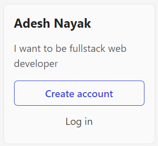

---

### Question 2.

All the product names stored in the array
```javascript
let list = document.querySelectorAll(".as-imagegrid-item")
let productList = [];
list.forEach(elem => productList.push(elem.innerText.replace("\nSupport", "")))
console.log(productList);

```

Output
['iPhone', 'Mac', 'iPad', 'Watch', 'AirPods', 'Music', 'TV']

---

### Question 3.
Add new FAQ in the list
```javascript
let sec = document.createElement("section")
sec.className = "parent"
let text = document.createTextNode("My New FAQ")
let h3 = document.createElement("h3")
sec.appendChild(h3)
h3.appendChild(text)
document.querySelector(".accordion-homepage").appendChild(sec)
```
output
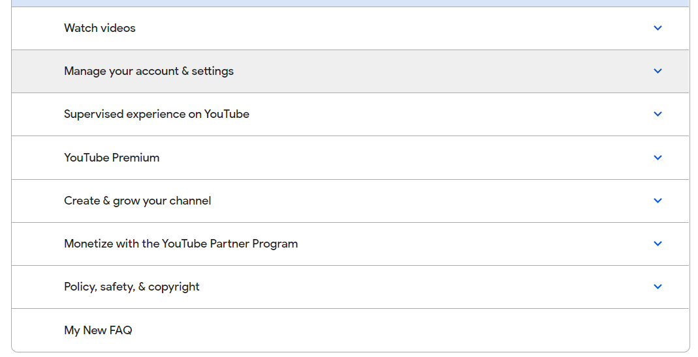

---

### Question 4.

Change the contact number
```javascript
document.querySelector(".service-number").innerHTML = "+918220695870"
```


---


### Question 5.

Change the button text
```javascript
document.querySelector(".feature-column-carousel__feature .cta").innerHTML = "Check Out";
```
Output Image
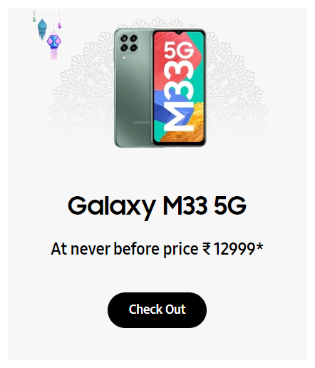

---

### Question 6.

Change the color to red when mouse hovers over search bar
```javascript
let form = document.querySelector(".searchinput___zXLAR")
const bgColor = () => {
    form.style.background = "red";
    setTimeout(() => {
        form.style.background = "";
    }, 500)
}
form.addEventListener('mouseover', bgColor)
```

---

### Question 7.
To Search a topic in the MDN Search bar.
First add a text to search in the search bar and then hit the submit search button to search the docs using DOM.

```javascript
let input = document.getElementById("hp-search-input")
const search = (inputText) => {
    input.value = inputText;
    let form = document.getElementById("hp-search-form");
    from.submit();
}

search("css");
```
Output Image
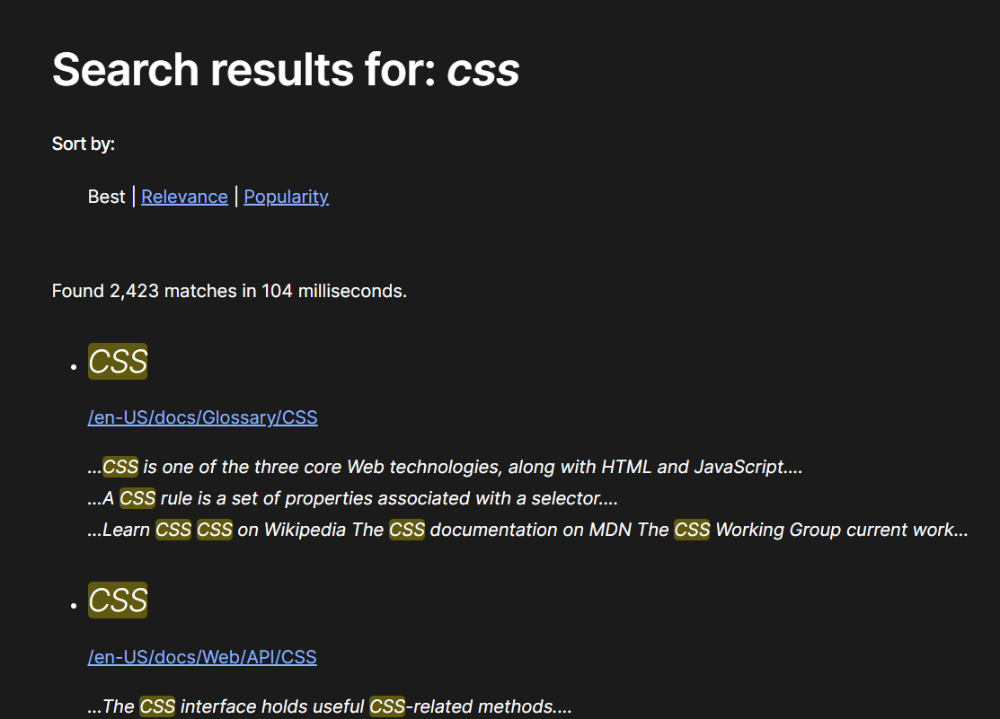

---

### Question 8.
remove alternate languages from google language bar

```javascript
let items = document.querySelectorAll("#SIvCob a")
for(let i=0; i<items.length; i++) {
    if(i%2 !== 0) {
        items[i].remove();
    }
}
```

Output Image
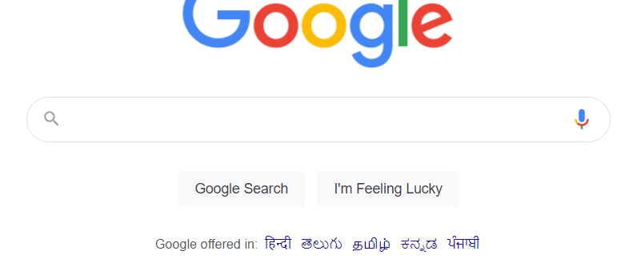

---

### Question 9.
change the color and font family of the text

```javascript
let h1 = document.querySelector(".display-heading-1")
h1.style.color = "#B1361E"
h1.style.fontFamily = "monospace"
```
Output Image
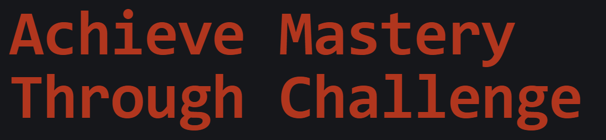

---

### Question 10.

change the background color when mouse hover on it
```javascript
let textColor = document.querySelector(".login-btn-text")
textColor.addEventListener('mouseover', () => { textColor.style.background = "red"})
textColor.addEventListener('mouseout', () => { textColor.style.background = "none"})
```

---

### Question 11.
Change the realme logo to iNeuron logo
```javascript
let logo = document.querySelector(".icon-logo")
logo.style.backgroundImage = 'url("https://ineuron.ai/images/ineuron-logo.png")'
```
Output Image


---

### Question 12.
Change the background color of github repository button

```javascript
let button = document.querySelector(".btn-primary")
button.style.background = "blue"
button.style.color = "black"
```
Output Image
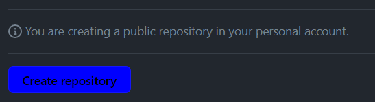

---


### Question 13.
Change the text to "JSBOOTCAMP"
```javascript
document.querySelector(".fl-heading-text").innerHTML = "JSBOOTCAMP"
```

Output Image


---

### Question 14.
Change the font size of "Hot Deals" to 80px

```javascript
let heading = document.querySelector(".HotDealsAll__Heading__2fIbe")
heading.style.fontSize = "80px"
```
Output Image
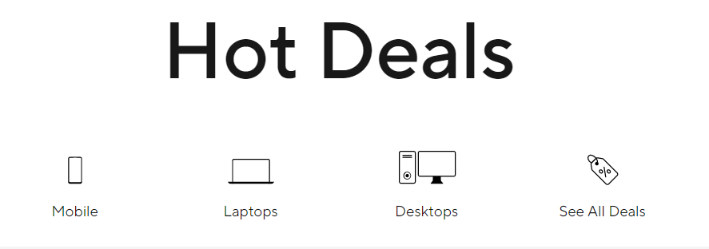

---

### Question 15.
Change the alignment of text from left to right

```javascript
let proName = document.querySelector("#d560824win9b .ps-title")
proName.style.textAlign = "right"
```
Output Image


---

### Question 16.
Change the heading "Start with the developer" to "Start with Scratch"

```javascript
document.querySelector(".jsx-499702677 h4").innerHTML = "Start with Scratch"
```

Output Image
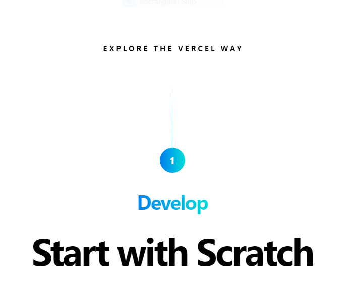

---

### Question 17.
Change the button text to current Date

```javascript
document.querySelector(".btn-container").innerHTML = Date();
```

Output Image
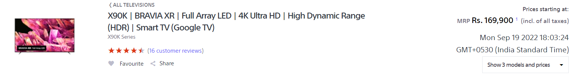

---

### Question 18.
Change the background color to orange

```javascript
let footer = document.querySelector(".p-f03-footer-container")
footer.style.background = "orange"
```

Output Image
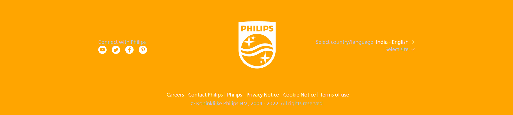

---

### Question 19.
Extract the canon logo

```javascript
document.querySelector(".navbar-brand .logo").src
```

---

### Question 20.
Change the description color from black to orange

```javascript
let h3 = document.querySelector(".desc")
h3.style.color = "orange"
```
Output Image
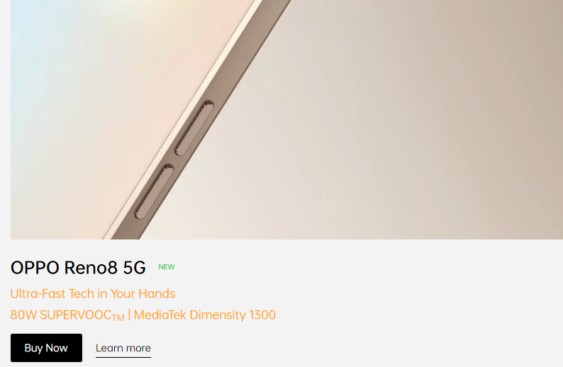

---
